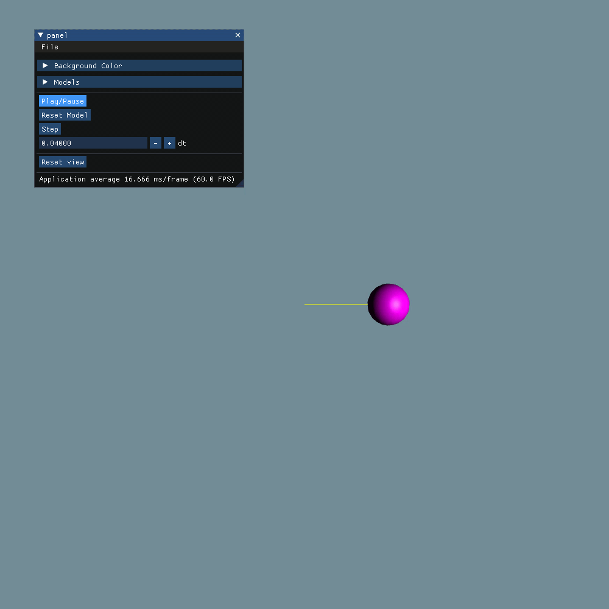
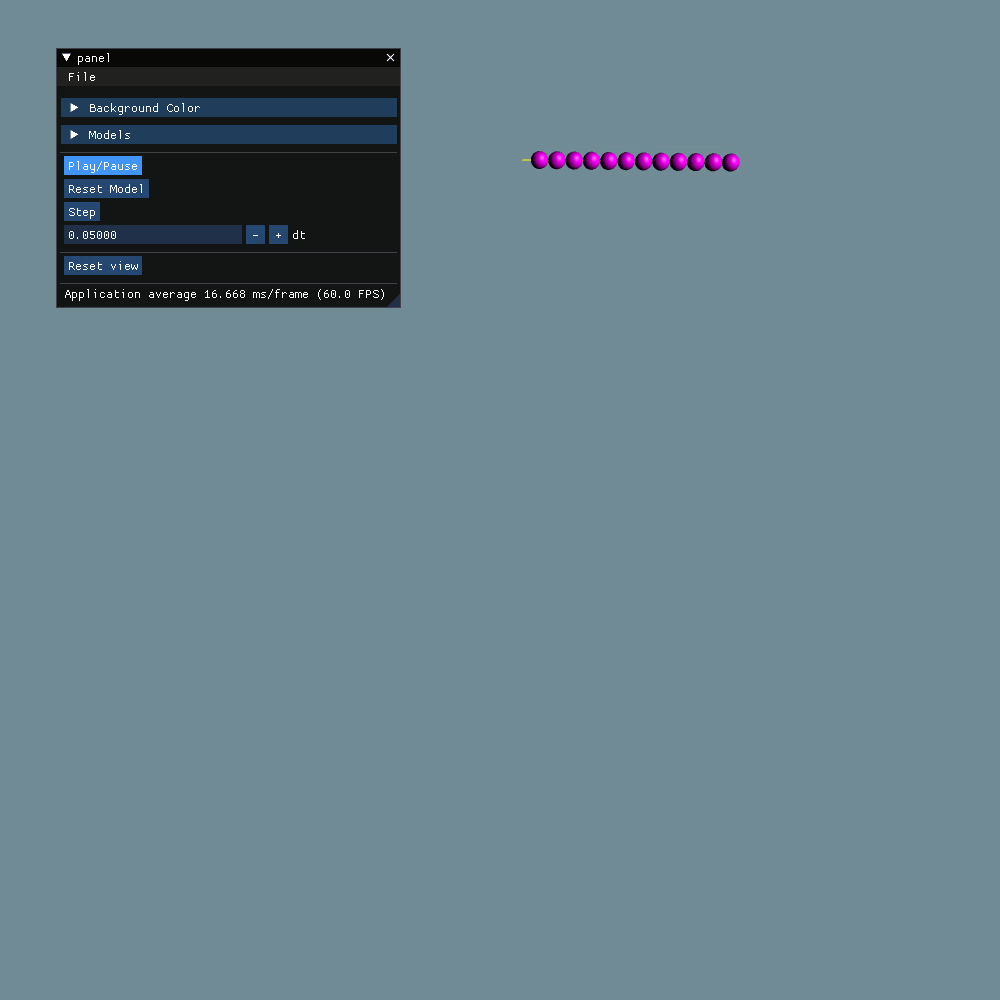
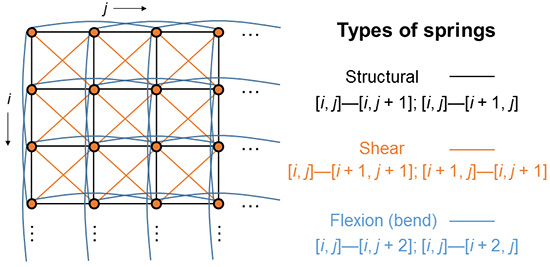
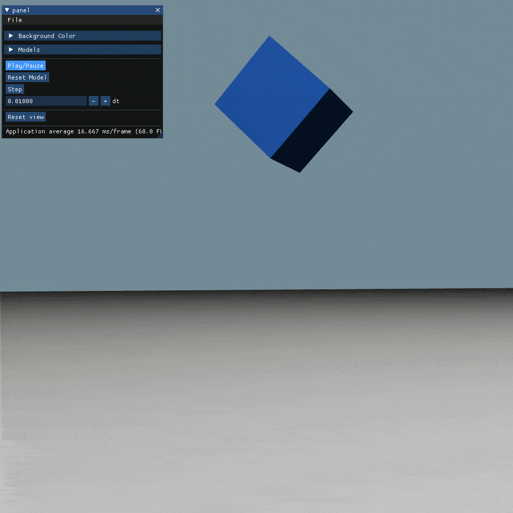
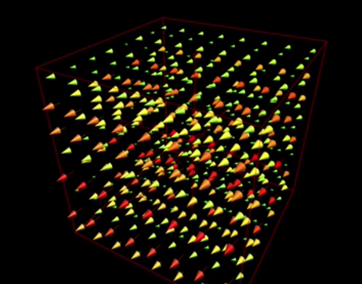

# Mass Spring Simulation

This is the fourth assignment of CPSC 687 (Animation) course held in winter 2022 semester at the University of Calgary.
In this assignment, I implemented a single spring, a chain of springs, a hanging cloth, a jelly cube, a table cloth, 
and a flag in the wind.

## Particle
Each Particle has these attributes.

- `mass` (float)
- `position` (vec3f)
- `Velocity` (vec3f)
- `isStationary` (bool) -> indicates that a particle is stationary or not
- `initialPosition` (vec3f) -> useful for resetting the model

And some methods.

- `applyForce(vec3f force, float dt)`

    This function applies force on the particle by changing its velocity based on its mass.  

- `applyGravity(float g, float dt)`

  This function applies gravity on the particle by changing its velocity.

- `applyAirResistance(float airK, float dt)`

  This function applies air resistance force on the particle based on its velocity.

- `applySpeedOnPosition(float dt)`

    This function moves the particle based on its velocity.

***These functions have no effects if the particle is stationary***

## Spring

Each Spring has these attributes

- `head` (shared pointer to the head particle)
- `tail` (shared pointer to the tail particle)
- `restSize` (float) 
- `k` (float) -> spring stiffness
- `c` (float) -> spring damping constant

And some methods.

- `vec3f springForce()`
  
  Returns the force of spring on the head particle. The amount of force for the tail particle is its negative.

- `vec3f dampForce()`

  Returns the damping force for the head particle. The amount of force for the tail particle is its negative.

- `applySpringForces(float dt)`

  This function applies springForce and dampForce on the head and tail particles.


## Model

Each model has some particles and springs.

- `std::vector<std::shared_ptr<Particle>> particles`
- `std::vector<Spring> springs`

The connection between particles are defined in each derived model, such as ChainSpringModel, TableClothModel, etc.

For the sake of simplicity, Model class has these two functions.

- `void step(float dt)`
  ```c++
  virtual void step(float dt) {
            for (auto &spring: springs) {
                spring.applySpringForces(dt);
            }
            for (auto &particle: particles) {
                particle->applyGravity(gravity, dt);
                particle->applyAirResistance(airK, dt);
                applyExternalForces(particle, dt);
            }
            for (auto &particle: particles) {
                particle->applySpeedOnPosition(dt);
            }
        };
  ```

  Which applies spring forces on particles in the first loop. Then applies gravity and air resistance on each particle 
and then applies external forces on each particle, which is overrided in each model separately. External forces are mostly 
the collision forces.  

- `void reset` 
  ```c++
  virtual void reset() {
        for (auto &particle: particles) {
            particle->position = particle->initialPosition;
            particle->velocity = vec3f{0.f};
		      }
  };
  ```
  This function resets each particle to its initial position, and its velocity to zero.


## ChainSpringModel

ChainSpringModel is used to create single spring and chain spring parts of the assignment. 
This model has a vector of particles and a vector of springs. There is also a single stationary particle at the top.

The particles and springs are created in the constructor like bellow.

```c++
void ChainSpringModel::createParticlesAndSprings() {
    head = std::make_shared<Particle>(vec3f{0.f, 0.f, 0.f}, mass, true);
    for (unsigned int i = 0; i < particlesCount; i++) {
        particles.emplace_back(std::make_shared<Particle>(vec3f{static_cast<float>(i+1) * springLength, 0, 0.f}, mass));
        springs.emplace_back(Spring(i == 0 ? head : particles[i-1], particles[i], springRest, springK, springC));
    }
};
```
`head` is the root of chain at the position `(0, 0, 0)` and other particles are initiated at the x-axis.

The Chain spring model variables are 

```c++
unsigned int particlesCount = 11; // 1 for single spring
float mass = 1.f; // each particle mass
float springLength = 1.f; // initial length of each spring
float springRest = 1.f; // spring rest length
float springK = 20; // spring stiffness
float springC = 0.3; // spring damp constant
```

**Single Spring Demo**



**Chain Spring Demo**



## Jelly Cube

Jelly cube is a 3D network of particles and springs.

The variables of the particles and springs are as bellow. 

```c++
unsigned int resolution = 10; // number of particles in each dimension -> 1000 particles at all 
float mass = 0.5f; // mass of each particle
float springLength = 1.f; // initial structural spring length (distance between neighbor particles)
float springK = 150; // springs' stiffness
float springC = 2 * std::sqrt(mass * springK) * 0.9; // springs' damp constant
```
I used the amount of `2 * std::sqrt(mass * springK) * 0.9` for damping parameter to have a slightly under damped 
network of springs.

This network has three types of springs.
1. **Structural** springs, which connects each particle to their edge neighbors
2. **Shear** springs, which connects each particle to their diagonal neighbors
3. **Flexion** spring, which connects each particle to their second edge neighbors 



image source: https://www.ics.uci.edu/~shz/courses/cs114/docs/proj3/index.html

p.s: I removed flexion springs for this structure because it feels more similar to jelly cube without them. Maybe for more 
robust versions flexion springs are useful.

### Collision detection
In this part of assignment, I used the `y=0` plane as ground. 
For collision detection, for each particle, if they have crossed this plane (`particle.position.y < 0`) 
I changed reflect their speed based on this plane and multiplied it by `0.3` to create energy waste simulation due to collision.

Also, for all the particles in very small distance of the ground I implemented the friction by multiplying the velocity by 
`0.1`.

This simple collision detection worked for this part, but I implemented a better collision detection for the TableCloth part of the assignment.

***All the springs are in the rest position at the start.***




## Cloth

For simulating a cloth, I created a 2D mesh of particles, connected with 3 types of springs, 
**Structural**, **Shear**, and **Flexion** with the same definition as the jelly cube part.

The model variables for cloth are as bellow.

```c++
unsigned int resolution = 40;
float mass = 1.f;
float springLength = 25.f / 40.f;
float springK = 2500;
float springC = 1;
```

The first and the last particles of the first row of the cloth are stationary to make it hanging. 
All the particles are initiated in the xz-plane to fall after start of simulation.

***All the springs are in the rest position at the start.***


## Flag

Creating a flag was same as the cloth. The challenges where to simulate wind and area based force.

These are the variables used in the flag which are almost same as the cloth.

Also, the initial position of flag is in the xy-plane and some of the first column particles are set as stationary.

The flag is using the same three springs.

***All the springs are in the rest position at the start.***

```c++
unsigned int resolution = 40;
float mass = 1.f;
float springLength = 25.f / 40.f;
float springK = 2500;
float springC = 0.7;
```

###Wind simulation

I have started the wind simulation by creating some wind sources, but the result was not interesting. 
The flag was getting steady very soon as the wind speed was constant in each point. 
So I created wind based on a time-varying function based on this article. https://steven.codes/blog/cloth-simulation/

The idea comes from that the wind in each point should be a function based on its location and time. 

The function I used is such as bellow. 

`windSpeed = 20 * {1.5 * abs(sin(x + time * 5) + cos(y + time * 5)), 0, 0f * sin(time * 5)};`

Which `20` is the scale of wind, and the `x` is using sin and cos to create periodic behavior in wind and z parameter is only based on the time. 



Visualization of wind speed in different points of the space. Source: https://steven.codes/blog/cloth-simulation/

###Area based wind effect 

As mentioned in ***Animation Aerodynamics***, the effect of wind speed on particle is based on the difference between wind speed 
and the particle speed. I used this fact on the mesh triangle center. 

So for each triangle in mesh, I calculate the position and velocity of the center and area of triangle. Then I calculate the force 
based on center velocity and effect the area in the amount of the force.

At last, I apply the calculated force on all 3 particles of triangle.

Here's the code of this part: 

```c++
void Flag::applyWindOnFace(std::shared_ptr<Particle> p1, std::shared_ptr<Particle> p2, std::shared_ptr<Particle> p3,
							   float dt) {
    auto centerPos = (p1->position + p2->position + p3->position) / 3.f;
    auto centerSpeed = (p1->velocity + p2->velocity + p3->velocity) / 3.f;

    auto windSpeed = 20.f * vec3f {1.5f * abs(sin(centerPos.x + time * 5) + cos(centerPos.y + time * 5)), 0.f, 0.5f * sin(time * 5)};
    auto edge12 = p1->position - p2->position;
    auto edge13 = p1->position - p3->position;
    float area = 0.5f * glm::length(glm::cross(edge12, edge13));
    auto windForce = 1.f * area * (windSpeed - centerSpeed);
    p1->applyForce(windForce, dt);
    p2->applyForce(windForce, dt);
    p3->applyForce(windForce, dt);
}
```

***All the springs are in the rest position at the start.***


## Tablecloth 

For creating tablecloth, I created a 2d mesh as I did before for cloth and flag, but this time no particles were stationary.

These are the variables for tablecloth

```c++
unsigned int resolution = 40;
float mass = 3.f;
float springLength = 25.f / 40.f;
float springK = 3000;
float springC = 8;

float offset = (resolution - 1) * springLength / 2; // the height of falling 
vec3f tableCenter = vec3f {offset, 0.f, offset};
float tableRadius = offset*0.7;
```

### Collision handling

For collision handling, I used prediction of particle position in the next `dt` time.
I measure the vertical distance between the table and the particle in both times. 
If the particle crossed the table surface, I will reflect and damp the particle speed.  

The code is such as bellow.

```c++
void TableClothModel::applyExternalForces(std::shared_ptr<Particle> particle, float dt) {
    auto &position = particle->position;
    auto nextPosition = particle->position + particle->velocity * dt;

    auto verticalDistance = position.y - tableCenter.y;
    auto nextVerticalDistance = nextPosition.y - tableCenter.y;

    auto isOnTable = glm::length(vec2f{tableCenter.x, tableCenter.z} - vec2f{position.x, position.z}) < tableRadius;
    auto isNextOnTable = glm::length(vec2f{tableCenter.x, tableCenter.z} - vec2f{nextPosition.x, nextPosition.z}) < tableRadius;

    if (isOnTable && isNextOnTable && verticalDistance * nextVerticalDistance < 0) {
        particle->velocity.y = -particle->velocity.y;
        particle->velocity *= 0.01;
    }
}
```

So, this approach will perfectly handle the collision of tablecloth and the table from top and bottom 
(for the contact of tablecloth corners from the bottom). This method also handles the friction between table and cloth by 
multiplying to `0.01`;

Unfortunately, my self collision approach was too slow, so I removed it from the code.

***All the springs are in the rest position at the start.***


## Rendering

- For single and chain springs, I used the same code as it was in the code materials. I represent 
  each particle with a [Sphere](https://givr.readthedocs.io/en/latest/reference-manual/geometry.html#sphere) with `0.5` radius and 
  used a [Polyline](https://givr.readthedocs.io/en/latest/reference-manual/geometry.html#polyline) for showing the springs.
- For cloths and jelly cubes I used [TriangleSoup](https://givr.readthedocs.io/en/latest/reference-manual/geometry.html#triangle-soup) 
and create triangles from neighbor particles. 
- Also, created a big [Triangle](https://givr.readthedocs.io/en/latest/reference-manual/geometry.html#triangle)
as ground for the jelly cube part, and created a [Cylinder](https://givr.readthedocs.io/en/latest/reference-manual/geometry.html#cylinder) 
as the table for tablecloth part (which didn't have the surfaces eventually).

Compilation
-----------

## How to Install Dependencies (Ubuntu)

    sudo apt install cmake build-essential

## How to Build

    cmake -H. -Bbuild -DCMAKE_BUILD_TYPE=Release
    cmake --build build

## How to Run

    build/simple


## Resources:

***GIVR***: https://lakin.ca/givr/

***Animation aerodynamics***: Reference: J. Wejchert and D. Haumann: Animation aerodynamics. Computer Graphics
25 Nr. 4, 1991 (Proceedings of SIGGRAPH 1991), pp. 19-22.

***Steven.codes***: https://steven.codes/blog/cloth-simulation/
